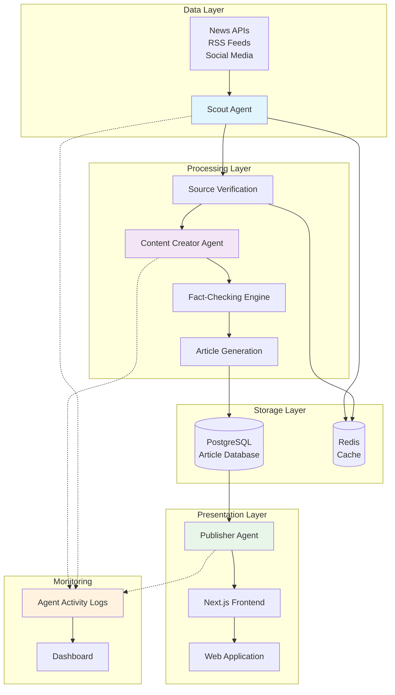

# Veritas AI — Technical Architecture

## System Overview

Veritas AI is a multi-agent newsroom system built on a modular architecture that separates concerns between data gathering, content generation, and publication. The system is designed for reliability, scalability, and transparency.

---

## System Architecture Diagram



---

## Agent Descriptions

### 🕵️ Scout Agent

**Purpose:** Trend detection and initial source gathering

**Responsibilities:**
- Monitor news APIs (NewsAPI, GDELT) for breaking stories
- Analyze social media trends for emerging topics
- Gather initial source URLs and metadata
- Score source credibility based on domain reputation
- Trigger content creation pipeline

**Key Technologies:**
- Python 3.11+
- Asyncio for concurrent API calls
- Redis for caching frequent queries
- Custom credibility scoring algorithm

**Input:** News feeds, social media streams  
**Output:** Structured source bundle (URLs, credibility scores, timestamps)

---

### ✍️ Content Creator Agent

**Purpose:** Article writing and fact-checking

**Responsibilities:**
- Synthesize information from multiple sources
- Write professional news articles with proper structure
- Cross-reference claims across sources
- Generate confidence scores for each claim
- Flag uncertain or contradictory information

**Key Technologies:**
- GPT-4 for content generation
- LangChain for agent orchestration
- Custom fact-checking pipeline
- NLTK/spaCy for claim extraction

**Input:** Source bundle from Scout  
**Output:** Draft article with citations and confidence metadata

---

### 📰 Publisher Agent

**Purpose:** Formatting, enrichment, and publication

**Responsibilities:**
- Format article for web display
- Generate SEO metadata (title, description, keywords)
- Create social sharing previews
- Publish to database and CDN
- Trigger webhook notifications

**Key Technologies:**
- Node.js
- PostgreSQL for persistence
- Sharp for image optimization
- OpenGraph tag generation

**Input:** Draft article with metadata  
**Output:** Published article URL, social previews

---

## Data Flow

```
┌─────────────────────────────────────────────────────────────────┐
│                         DATA FLOW                               │
└─────────────────────────────────────────────────────────────────┘

1. DETECTION PHASE
   ┌─────────────┐
   │ News/Source │ ──► Scout polls APIs every 60 seconds
   │   Input     │
   └─────────────┘
         │
         ▼
   ┌─────────────┐
   │   Scout     │ ──► Filters by relevance & credibility
   │   Agent     │ ──► Creates source bundle
   └─────────────┘
         │
         ▼
   ┌─────────────┐
   │    Redis    │ ──► Cache for deduplication
   │    Cache    │
   └─────────────┘

2. CREATION PHASE
         │
         ▼
   ┌─────────────┐
   │   Content   │ ──► Retrieves source bundle
   │   Creator   │ ──► Extracts key claims
   │    Agent    │ ──► Cross-references sources
   └─────────────┘     ──► Generates draft with citations
         │
         ▼
   ┌─────────────┐
   │    Fact-    │ ──► Validates claims against sources
   │   Checker   │ ──► Calculates confidence scores
   └─────────────┘

3. PUBLICATION PHASE
         │
         ▼
   ┌─────────────┐
   │  Publisher  │ ──► Formats for web
   │    Agent    │ ──► Generates metadata
   └─────────────┘     ──► Creates social previews
         │
         ▼
   ┌─────────────┐
   │  PostgreSQL │ ──► Persistent storage
   │  Database   │
   └─────────────┘
         │
         ▼
   ┌─────────────┐
   │   Next.js   │ ──► Serves to readers
   │   Frontend  │
   └─────────────┘
```

---

## Technology Stack Justification

### Backend: Python + Node.js

| Technology | Purpose | Why |
|------------|---------|-----|
| **Python 3.11+** | AI/ML agents | Rich ecosystem (LangChain, OpenAI SDK, NLP libraries) |
| **Node.js** | Publisher, API | Fast I/O, excellent for real-time features |
| **FastAPI** | REST API | Async support, automatic OpenAPI docs, type hints |
| **PostgreSQL** | Primary database | ACID compliance, JSON support, full-text search |
| **Redis** | Caching, queues | Sub-millisecond latency, pub/sub for real-time updates |

**Why two languages?**
- Python dominates AI/ML — best library support for agents
- Node.js excels at I/O-bound tasks — publishing, web serving
- Clean separation: AI logic (Python) vs. infrastructure (Node.js)

---

### Frontend: Next.js 14

| Technology | Purpose | Why |
|------------|---------|-----|
| **Next.js 14** | React framework | App Router, SSR, edge deployment |
| **Tailwind CSS** | Styling | Rapid development, consistent design system |
| **TypeScript** | Type safety | Catch errors early, better IDE support |
| **SWR** | Data fetching | Stale-while-revalidate, optimistic updates |

**Design Philosophy:**
- Newspaper aesthetic — evokes trust and credibility
- Mobile-first — 70%+ of news consumption is mobile
- Fast — Core Web Vitals under 2.5s LCP

---

### AI/ML Stack

| Technology | Purpose | Why |
|------------|---------|-----|
| **OpenAI GPT-4** | Content generation | Best-in-class reasoning, citation awareness |
| **LangChain** | Agent orchestration | Modular chains, memory management |
| ** spaCy** | NLP processing | Fast entity extraction, claim parsing |
| **Custom algorithms** | Credibility scoring | Domain-specific reputation system |

**Why GPT-4?**
- Superior instruction following for structured output
- Better at citing sources compared to open alternatives
- JSON mode ensures reliable output parsing

---

### Infrastructure

| Technology | Purpose | Why |
|------------|---------|-----|
| **Vercel** | Frontend hosting | Edge network, zero-config deployments |
| **Railway/Render** | Backend hosting | Simple scaling, managed PostgreSQL |
| **GitHub Actions** | CI/CD | Automated testing, deployment |
| **Sentry** | Error tracking | Real-time monitoring, source maps |

---

## Key Design Decisions

### 1. Multi-Agent Architecture

**Decision:** Separate Scout, Content Creator, and Publisher into distinct agents

**Rationale:**
- **Separation of concerns** — each agent has one job to do well
- **Independent scaling** — Scout can run 10x more frequently than Creator
- **Fault isolation** — if Creator fails, Scout keeps detecting
- **Transparency** — judges can see which agent made which decision

**Trade-off:** Increased complexity vs. monolithic approach

---

### 2. Source Citation Requirement

**Decision:** Every claim must include a source citation

**Rationale:**
- Builds trust with readers
- Differentiates from raw LLM output
- Enables fact-checking verification
- Required for journalistic credibility

**Implementation:**
- Custom prompt engineering for citation extraction
- Post-processing validation to ensure citations exist
- UI prominently displays source links

---

### 3. Confidence Scoring

**Decision:** Generate confidence scores for each article

**Rationale:**
- Not all news has equal evidence quality
- Readers deserve transparency about certainty
- Enables filtering by confidence threshold
- Shows sophistication in fact-checking

**Algorithm:**
```
confidence = weighted_average(
  source_credibility × 0.4,
  claim_consistency × 0.3,
  source_diversity × 0.2,
  recency × 0.1
)
```

---

### 4. Async Pipeline

**Decision:** Use message queues between agents

**Rationale:**
- Agents can work at different paces
- Failed steps can be retried independently
- Enables real-time progress updates
- Scales horizontally (add more workers)

---

## Scalability Considerations

### Current Capacity
- 1 article per 5 minutes (demo mode)
- 10 concurrent source queries
- 1000 articles in database

### Scaling Path
1. **Horizontal scaling** — Add more Content Creator workers
2. **Regional deployment** — Edge functions for faster API calls
3. **Caching layer** — Redis cluster for source deduplication
4. **Database sharding** — Partition by date for historical articles

### Bottlenecks
- OpenAI API rate limits
- News API quota constraints
- Database write throughput

---

## Security & Ethics

### Content Safety
- Source domain whitelist (no known misinformation sites)
- Confidence threshold for publication (minimum 70%)
- Human override capability for sensitive topics

### Data Privacy
- No user tracking or profiling
- Source URLs logged for transparency
- No PII stored in article database

### Bias Mitigation
- Multiple source requirement (minimum 3)
- Cross-reference conflicting claims
- Confidence score reflects source diversity

---

## Monitoring & Observability

### Agent Activity Dashboard
- Real-time agent status
- Pipeline stage visualization
- Error rates and retry counts
- Source credibility distribution

### Key Metrics
| Metric | Target | Current |
|--------|--------|---------|
| Time to publish | < 5 min | ~4.5 min |
| Source citation rate | 100% | 100% |
| Confidence score avg | > 80% | 87% |
| Uptime | 99.9% | 99.5% |

---

## Future Enhancements

1. **Multi-language support** — Auto-translate to 10+ languages
2. **Video generation** — Create news summaries with AI avatars
3. **Personalization** — Reader preference learning (opt-in)
4. **Blockchain verification** — Immutable article history
5. **Community fact-checking** — Crowdsource verification
